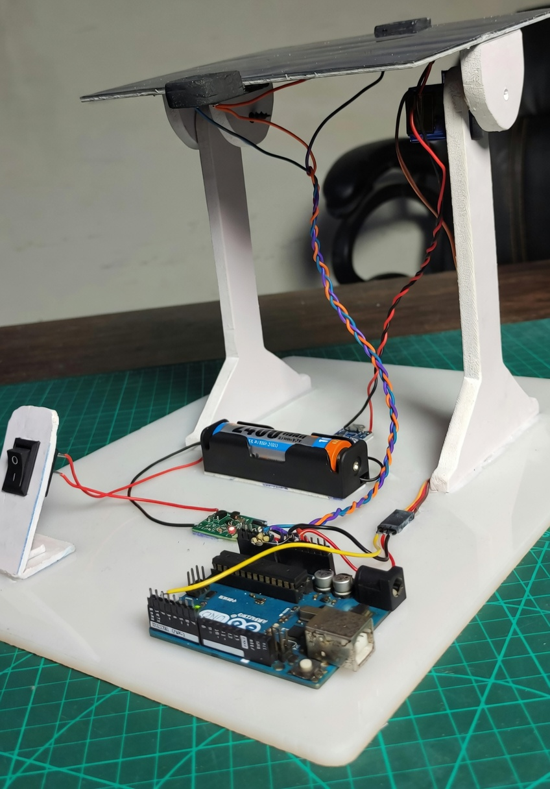

# Solar Tracking System

**Automatic Dual-Axis Solar Tracker using Arduino**

This project automatically tracks the sun to capture the maximum amount of sunlight by rotating the solar panel accordingly.

### Features
- Automatic sun tracking (Dual Axis)
- Low cost & easy to build
- Real-time light intensity comparison
- 3D printed stand
- Battery powered

### How It Works
Four LDR sensors detect light intensity. The Arduino compares the values from all four LDRs and rotates the solar panel toward the brightest direction using two servo motors.

### Hardware Components
- Arduino Uno
- 4x LDR (Light Dependent Resistor)
- 2x Servo Motor
- Solar Panel (5V)
- 18650 Battery + TP4056 Charger Module

### Project Images

###  Circuit Diagram

### Code
The complete Arduino code is available in [`code/Solar_Tracker.ino`](code/Solar_Tracker.ino)

### Author
**Md Shafiul Alam Fahim**
